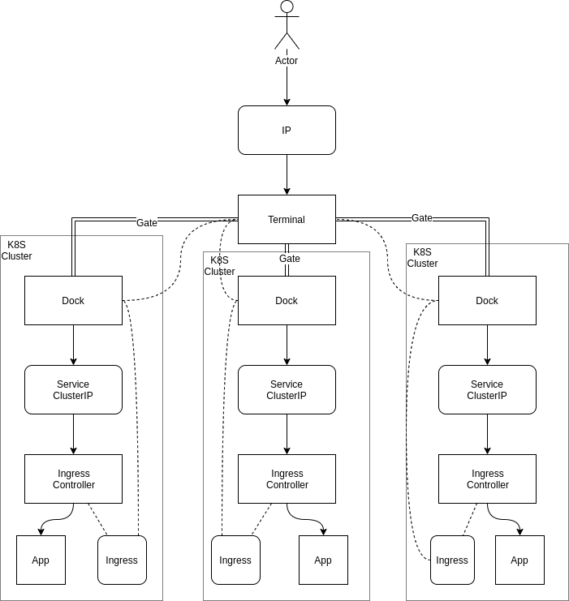

# BoardingBridge

Shared Kubernetes Ingress

## Concept

### Terminal

_Terminal_ has an IP (with service `LoadBalancer` for example) and select on which _dock_ to send traffic regarding `HOST` Header or using SNI.

### Gate

An HTTP2 secured bidirectionnal tunnel.

### Dock

Engine in cluster which request a _gate_ to a _terminal_ and propagate ingress `Host` configuration.

It forward traffic to an Ingress Controller "as it".
Ingress Controller is reponsible for SSL (for example).

## Why

On a cloud privider services type `Loadbalancer` can be expensive when only used for testing cluster.

With _BoardingBridge_ you can share 1 IP for many clusters.

## State

Not done!